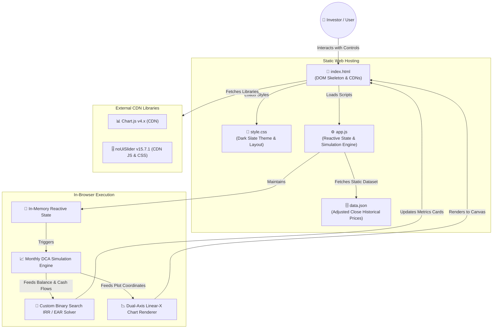
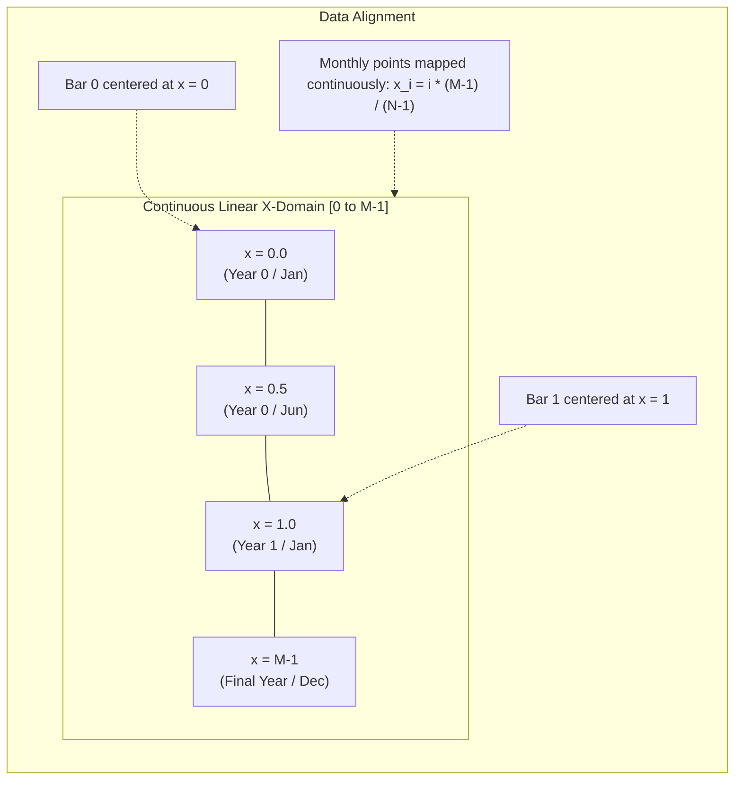

# Retirement Growth Simulator: AI Agent Design Document & Blueprint

> **Target Audience:** Autonomous AI Agents, LLM Code Assistants, and Systems Engineers.  
> **Purpose:** This document provides the rigorous architectural, mathematical, logic, and UI specifications required to replicate the Retirement Growth Simulator application from scratch, without needing to reference the original source code.

---

## 1. System Architecture & File Structure

The Retirement Growth Simulator is a **100% Serverless, Client-Side Single Page Application (SPA)** with zero build steps, zero transpilation, and zero backend compute requirements. It executes natively in all modern web browsers.

### 1.1 Architectural Flow Diagram



### 1.2 The 3 Primary Application Files (+ Data Asset)

The application consists strictly of three core source files and one static data asset:

1. **`index.html`**:
   - Semantic HTML5 document containing the complete DOM hierarchy.
   - External dependencies loaded via CDN (Chart.js and noUiSlider).
   - Control panels (Index selector, Contribution mode, Catch-up toggles, Dual-handle date slider).
   - Metric summary cards (Total Contributions, Final Balance, Annualized Return).
   - Canvas wrapper for the Chart.js visualization.
   - Assumptions and disclosures footer.
2. **`style.css`**:
   - Modern Dark Slate design system inspired by Tailwind CSS (`slate-900`, `slate-800`, `slate-700`).
   - Neon Cyan (`#06b6d4`) accent glow, typography scale, custom inputs, custom segmented radio controls.
   - Complete CSS overrides for the noUiSlider widget (custom handles, track fills, active states).
   - Responsive flexbox container preventing layout shifting when secondary controls toggle.
3. **`app.js`**:
   - Reactive event handlers and state controller.
   - IRS contribution limit and catch-up tables (1993–2026).
   - Dual-handle noUiSlider controller with date-range preservation across index switching.
   - Monthly Dollar-Cost-Averaging (DCA) simulation engine.
   - Custom Binary Search Internal Rate of Return (IRR) numerical solver converting to Effective Annual Rate (EAR).
   - Dual-axis Chart.js controller with continuous linear X-axis coordinate mapping.
4. **`data.json`**:
   - Static dictionary mapping ticker symbols (`SPY`, `QQQ`, `DIA`) to ISO-formatted month strings (`YYYY-MM`) and their respective dividend-adjusted close prices.

---

## 2. Data Models & Static Specifications

### 2.1 Historical Adjusted Close Dataset (`data.json`)
The application requires a static JSON payload containing historical month-end adjusted close prices. Adjusted close prices account for stock splits and assume instant, frictionless reinvestment of all dividends without tax drag.

```json
{
  "SPY": {
    "1993-01": 24.113248825073242,
    "1993-02": 24.370500564575195,
    "..." : "..."
  },
  "QQQ": {
    "1999-03": 44.212013244628906,
    "..." : "..."
  },
  "DIA": {
    "1998-01": 43.68569564819336,
    "..." : "..."
  }
}
```

- **Keys:** Ticker symbols (`SPY`, `QQQ`, `DIA`).
- **Inner Keys:** Month timestamps strictly formatted as `YYYY-MM`.
- **Values:** Double-precision floating point adjusted close prices in USD.

### 2.2 Historical IRS 401(k) Employee Contribution Limits
Employee elective deferral limits under Internal Revenue Code Section 402(g) from 1993 to 2026:

| Year(s) | Annual Limit ($) | Monthly Equivalent ($) |
| :--- | :--- | :--- |
| **1993** | $8,994 | $749.50 |
| **1994–1995** | $9,240 | $770.00 |
| **1996–1997** | $9,500 | $791.67 |
| **1998–1999** | $10,000 | $833.33 |
| **2000–2001** | $10,500 | $875.00 |
| **2002** | $11,000 | $916.67 |
| **2003** | $12,000 | $1,000.00 |
| **2004** | $13,000 | $1,083.33 |
| **2005** | $14,000 | $1,166.67 |
| **2006** | $15,000 | $1,250.00 |
| **2007–2008** | $15,500 | $1,291.67 |
| **2009–2011** | $16,500 | $1,375.00 |
| **2012** | $17,000 | $1,416.67 |
| **2013–2014** | $17,500 | $1,458.33 |
| **2015–2017** | $18,000 | $1,500.00 |
| **2018** | $18,500 | $1,541.67 |
| **2019** | $19,000 | $1,583.33 |
| **2020–2021** | $19,500 | $1,625.00 |
| **2022** | $20,500 | $1,708.33 |
| **2023** | $22,500 | $1,875.00 |
| **2024** | $23,000 | $1,916.67 |
| **2025** | $23,500 | $1,958.33 |
| **2026+** | $24,000 | $2,000.00 |

*Implementation Note:* If the simulation encounters years beyond 2026, it safely falls back to the 2026 limit of $24,000.

### 2.3 Historical Age 50+ Catch-Up Limits (EGTRRA 2001)
Catch-up contributions were introduced by the Economic Growth and Tax Relief Reconciliation Act of 2001 (EGTRRA) starting in 2002:

| Year(s) | Annual Catch-up ($) | Monthly Equivalent ($) |
| :--- | :--- | :--- |
| **< 2002** | $0 (Not allowed by law) | $0.00 |
| **2002** | $1,000 | $83.33 |
| **2003** | $2,000 | $166.67 |
| **2004** | $3,000 | $250.00 |
| **2005** | $4,000 | $333.33 |
| **2006–2008** | $5,000 | $416.67 |
| **2009–2014** | $5,500 | $458.33 |
| **2015–2019** | $6,000 | $500.00 |
| **2020–2022** | $6,500 | $541.67 |
| **2023–2026+** | $7,500 | $625.00 |

*Catch-up Eligibility Rule:* Catch-up dollars apply in month $m$ if and only if:
$$\text{catchupEnabled} = \text{true} \quad \land \quad \text{year}(m) \ge \text{turn50Year} \quad \land \quad \text{year}(m) \ge 2002$$

### 2.4 Client-Side State Model
The application maintains state in runtime memory (no `localStorage` required):

```javascript
let marketData = null;            // Raw parsed data.json
let chartInstance = null;         // Chart.js instance reference
let allMonths = [];               // Sorted array of YYYY-MM strings for selected index
let currentStartMonthStr = null;  // Anchor string for start range preservation (e.g. "2000-01")
let currentEndMonthStr = null;    // Anchor string for end range preservation (e.g. "2024-12")
let isProgrammatic = false;       // Guard flag preventing event feedback loops
```

---

## 3. Core Financial Simulation Engine

The simulation runs instantaneously on every user interaction (input change, slider drag, index switch).

### 3.1 Cash Flow Timing & Operational Sequence

All deposits are modeled on an **End-of-Month (Ordinary Annuity)** basis:
1. The user begins the month with previous accumulated shares $S_{t-1}$.
2. On the final trading day of month $t$, the investor deposits contribution $C_t$.
3. The deposit buys fractional shares at the month-end adjusted close price $P_t$.
4. Dividends paid during the month are already embedded in $P_t$, naturally increasing the portfolio's effective share growth.
5. The portfolio balance at the close of month $t$ is evaluated as $V_t = S_t \times P_t$.

### 3.2 Detailed Algorithmic Step-by-Step

For an active window of chronological months $m_0, m_1, \dots, m_{N-1}$:

1. **Contribution Calculation:**
   $$\text{Year} = \text{parseInt}(m_t.\text{split}('-')[0])$$
   - If `mode === 'irs'`:
     $$\text{limit} = \text{irsLimits}[\text{Year}] \parallel 24000$$
     $$\text{catchup} = (\text{catchupEnabled} \land \text{Year} \ge \text{turn50Year} \land \text{Year} \ge 2002) \,?\, (\text{catchupLimits}[\text{Year}] \parallel 7500) : 0$$
     $$C_t = \frac{\text{limit} + \text{catchup}}{12}$$
   - If `mode === 'custom'`:
     $$C_t = \text{customAmount}$$

2. **Share Acquisition & Balance Accumulation:**
   $$\Delta S_t = \frac{C_t}{P_t}$$
   $$S_t = S_{t-1} + \Delta S_t \quad (S_{-1} = 0)$$
   $$\text{TotalContrib}_t = \text{TotalContrib}_{t-1} + C_t \quad (\text{TotalContrib}_{-1} = 0)$$
   $$V_t = S_t \times P_t$$

3. **Annual Aggregation:**
   $$\text{yearlySums}[\text{Year}] = \sum_{t \in \text{Year}} C_t$$

4. **Output Metrics:**
   - **Total Contributions Display:** Formatted as USD currency: $\text{TotalContrib}_{N-1}$.
   - **Final Balance Display:** Formatted as USD currency: $V_{N-1}$.
   - **Annualized Return Display:** Calculated via Binary Search IRR and converted to EAR (see Section 4).

---

## 4. Exact Mathematical Model: Annualized Return (IRR) & EAR

Calculating the true performance of an ongoing Dollar-Cost-Averaging retirement plan requires finding the **Internal Rate of Return (IRR)** of non-uniform monthly cash flows, then converting that monthly periodic rate into an **Effective Annual Rate (EAR)**.

### 4.1 Mathematical Formulation

Let:
- $N$ be the total number of months simulated ($t = 0, 1, \dots, N-1$).
- $C_t \ge 0$ be the cash inflow invested at the end of month $t$.
- $V_{\text{final}} = V_{N-1}$ be the terminal portfolio value at the end of month $N-1$.
- $r$ be the monthly internal rate of return (effective monthly discount rate).

Under ordinary annuity end-of-month timing:
- Contribution $C_0$ compounds for $N - 1$ months.
- Contribution $C_t$ compounds for $N - 1 - t$ months.
- Contribution $C_{N-1}$ compounds for $0$ months (deposited on the final day).

The Future Value function $FV(r)$ of all compounded contributions evaluated at time $N-1$ is:
$$FV(r) = \sum_{t=0}^{N-1} C_t (1 + r)^{N - 1 - t}$$

The Internal Rate of Return is the unique real root $r^*$ satisfying:
$$f(r^*) = FV(r^*) - V_{\text{final}} = 0$$

Equivalently, in Net Present Value (NPV) terms discounted to $t = 0$:
$$NPV(r) = \sum_{t=0}^{N-1} \frac{C_t}{(1 + r)^t} - \frac{V_{\text{final}}}{(1 + r)^{N-1}} = 0$$

Multiplying the NPV equation by $(1+r)^{N-1}$ produces the identical $FV(r) - V_{\text{final}} = 0$ equation.

### 4.2 Monotonicity & Existence of a Unique Root

For all realistic portfolios where $C_t \ge 0$, $\sum C_t > 0$, and $V_{\text{final}} > 0$:
For $r > -1$, each term $C_t (1 + r)^{N - 1 - t}$ has a non-negative derivative with respect to $r$:
$$\frac{d}{dr} FV(r) = \sum_{t=0}^{N-2} (N - 1 - t) C_t (1 + r)^{N - 2 - t} > 0$$

Since $\frac{d}{dr} FV(r) > 0$ for all $r \in (-1, \infty)$, $FV(r)$ is **strictly monotonically increasing**.
Furthermore:
$$\lim_{r \to -1^+} FV(r) = C_{N-1} < V_{\text{final}} \quad (\text{for growing investments})$$
$$\lim_{r \to \infty} FV(r) = \infty$$

By the Intermediate Value Theorem, there exists **one and only one** real root $r^* \in (-1, \infty)$.

### 4.3 Why Binary Search Was Chosen Over Newton-Raphson

In financial software engineering, Newton-Raphson is widely used but suffers from catastrophic failure modes when applied to DCA retirement simulations:

1. **High-Degree Polynomial Instability:** Over a 30-year timeframe ($N = 360$), $FV(r)$ is a polynomial of degree 359. Evaluating $f'(r)$ can cause severe floating-point exponent overflow or catastrophic cancellation.
2. **Derivative Divergence & Overshoot:** In periods of extreme market downturns (e.g., dot-com crash or 2008 GFC where $V_{\text{final}} \ll \sum C_t$), negative return guesses cause $f'(r)$ to flatten near $r \approx -0.99$, driving Newton-Raphson step $\Delta r = -\frac{f(r)}{f'(r)}$ into negative infinity or complex numbers.
3. **Guaranteed Unconditional Convergence:** Because $FV(r)$ is strictly monotonic, **Binary Search (Bisection Method)** is mathematically guaranteed to converge to the global root without computing derivatives.
4. **Deterministic Precision:** With $K = 50$ bisections:
   $$\text{Interval Width} = \frac{r_{\text{high}} - r_{\text{low}}}{2^{50}} = \frac{1.0 - (-0.99)}{2^{50}} \approx 1.767 \times 10^{-15}$$
   This achieves the theoretical resolution limit of IEEE-754 double-precision floating-point arithmetic in fewer than 0.1 milliseconds of JS CPU execution.

### 4.4 Complete Bisection Algorithm Specification

```
Algorithm: Monthly Internal Rate of Return (IRR) via Binary Search
Inputs:
  - monthlyContribs: Array of floats [C_0, C_1, ..., C_{N-1}]
  - finalBalance: Float V_{final}
Outputs:
  - annualizedReturnPercent: Float (EAR as a percentage)

1. If finalBalance <= 0 or sum(monthlyContribs) <= 0:
     Return 0.00%
2. Initialize bounds:
     low = -0.99   // Corresponds to -99% monthly loss
     high = 1.00   // Corresponds to +100% monthly gain
     r = 0.0
3. Loop for iteration from 1 to 50:
     r = (low + high) / 2.0
     futureValue = 0.0
     For j from 0 to N - 1:
       futureValue += monthlyContribs[j] * ((1.0 + r) ^ (N - 1 - j))
     If futureValue < finalBalance:
       low = r    // Rate is too low; need higher discount rate
     Else:
       high = r   // Rate is too high; need lower discount rate
4. Compute Effective Annual Rate (EAR):
     EAR = ((1.0 + r) ^ 12) - 1.0
5. Return EAR * 100.0 (formatted to 2 decimal places)
```

### 4.5 Conversion to Effective Annual Rate (EAR) vs. Nominal APR

A critical financial requirement is distinguishing between Nominal APR and EAR:
- **Nominal Annual Percentage Rate (APR):**
  $$\text{APR} = r_{\text{monthly}} \times 12$$
  *Why APR is wrong for investments:* APR ignores the compounding of returns earned during the earlier months of the year.
- **Effective Annual Rate (EAR):**
  $$\text{EAR} = (1 + r_{\text{monthly}})^{12} - 1$$
  *Why EAR is mandatory:* EAR accurately captures monthly compounding. The final percentage presented to the user is:
  $$\text{Annualized Return} = \left((1 + r^*)^{12} - 1\right) \times 100\%$$

---

## 5. Chart.js Dual-Axis & Continuous Linear X-Axis Architecture

Visualizing multi-decade retirement growth requires combining a fine-grained monthly curve (up to 360+ data points) with coarse-grained annual contribution bars (up to 30+ bars).

### 5.1 The Problem: Why Standard Categorical X-Axes Fail

In Chart.js, a default categorical axis (`type: 'category'`) maps data indices directly to discrete label slots:
1. **If X-axis labels are Months (`YYYY-MM`):** There are 360 discrete slots. An annual contribution bar occurs once per year. On a monthly category axis, the annual bar renders as a razor-thin needle in Month 0, followed by 11 completely empty slots, destroying the visual bar chart aesthetic.
2. **If X-axis labels are Years (`YYYY`):** There are only 30 discrete slots. A categorical axis will attempt to cram 12 distinct monthly line points into a single vertical categorical bucket, causing severe zig-zag artifacts, vertical stacking, or total failure of the hover tooltip.

### 5.2 The Solution: Continuous Linear X-Axis Mapping

To solve this, the X-axis is configured as a **Continuous Linear Scale** (`type: 'linear'`), where the X-coordinate domain spans from $0$ to $M - 1$ (where $M = \text{labels.length}$ is the total number of unique years).



### 5.3 Mathematical Coordinate Transformations

Let:
- $\text{labels} = [\text{Year}_0, \text{Year}_1, \dots, \text{Year}_{M-1}]$ be the sorted array of unique calendar years.
- $N$ be the total count of active monthly data points ($i = 0, 1, \dots, N-1$).

#### 1. Annual Bar Data Placement:
Each bar $k \in [0, M-1]$ is mapped to its exact integer year index:
$$\text{Bar}_k = \{ x: k, \; y: \text{yearlySums}[\text{Year}_k] \}$$

#### 2. Monthly Balance Line Data Placement:
Each monthly point $i \in [0, N-1]$ is linearly mapped across the continuous year span:
$$x_i = \begin{cases} 0 & \text{if } M \le 1 \text{ or } N \le 1 \\ i \times \frac{M - 1}{N - 1} & \text{otherwise} \end{cases}$$
$$\text{Line}_i = \{ x: x_i, \; y: V_i, \; \text{month}: m_i, \; \text{cumContrib}: \text{TotalContrib}_i \}$$

This guarantees that:
- Month $0$ ($i = 0$) aligns at $x = 0.0$.
- The final month ($i = N - 1$) aligns perfectly at $x = M - 1$.
- All intermediate months render at smooth fractional coordinates without jumping or clustering.

### 5.4 Chart.js Configuration & Callbacks

```javascript
scales: {
    x: {
        type: 'linear',
        min: 0,
        max: labels.length > 1 ? labels.length - 1 : 0,
        offset: true,                       // Ensures outer bars do not clip past axis edges
        grid: { display: false, drawBorder: false },
        ticks: {
            stepSize: 1,                    // Only place major tick markers at whole integers
            callback: function(value) {
                // Suppress fractional ticks; render only integer year strings
                if (Number.isInteger(value) && labels[value]) {
                    return labels[value];
                }
                return '';
            },
            autoSkip: true,
            maxTicksLimit: 20,
            minRotation: 45,
            maxRotation: 45
        }
    },
    y: {
        type: 'linear',
        display: true,
        position: 'left',
        title: { display: true, text: 'Total Balance ($)' },
        grid: { drawBorder: false },
        ticks: {
            callback: function(value) {
                if (value >= 1000000) return '$' + (value / 1000000).toFixed(1) + 'M';
                if (value >= 1000) return '$' + (value / 1000).toFixed(0) + 'k';
                return '$' + value;
            }
        }
    },
    y1: {
        type: 'linear',
        display: true,
        position: 'right',
        title: { display: true, text: 'Annual Contribution ($)' },
        max: y1Max,                         // Dynamic headroom (see Section 5.5)
        grid: { drawOnChartArea: false },   // Prevents clashing horizontal gridlines with left axis
        ticks: {
            callback: function(value) {
                if (value >= 1000) return '$' + (value / 1000).toFixed(0) + 'k';
                return '$' + value;
            }
        }
    }
}
```

### 5.5 Dynamic Bar Width & Right Y-Axis Headroom

1. **Bar Aesthetic Width (Golden Ratio):**
   - `barPercentage: 0.618` (Golden ratio multiplier ensures balanced bar thickness and negative space).
   - `categoryPercentage: 1.0`.
   - Bar Color: `#facc15` (Warm yellow/amber).
2. **Dynamic Y1 Headroom Calculation:**
   To keep annual contribution bars grounded at the bottom third of the chart so they do not overpower or visually collide with the exponential growth line:
   $$\text{maxAnnualContrib} = \max_k (\text{annualContribData}[k].y)$$
   $$\text{desiredMax} = \text{maxAnnualContrib} \times 2.5$$
   $$\text{roundedMax} = \lceil \frac{\text{desiredMax}}{10000} \rceil \times 10000$$
   $$y_{1,\text{max}} = \max(10000, \text{roundedMax})$$

### 5.6 Interactive Tooltip Customization

Because data points exist at fractional coordinates, the tooltip must extract rich metadata attached directly to the data payload:
- **Title Callback:** If hovering over the line, returns `context[0].raw.month` (`YYYY-MM`). If hovering over a bar, returns the integer year `labels[context[0].parsed.x]`.
- **Label Callback:**
  - For the line dataset: returns two formatted lines:
    1. `Total Balance: $XXX,XXX.XX`
    2. `Cumulative Contribution: $XXX,XXX.XX`
  - For the bar dataset: returns `Yearly Contribution: $XX,XXX.XX`.

---

## 6. UI / UX Design System & CSS Layout Specifications

The UI implements a responsive, dark-mode dashboard with neon accents.

### 6.1 Design Tokens & CSS Variables

```css
:root {
    --primary: #06b6d4;        /* Neon Cyan */
    --primary-hover: #0891b2;  /* Deep Cyan */
    --bg-color: #0f172a;       /* Slate 900 */
    --card-bg: #1e293b;        /* Slate 800 */
    --text-main: #f8fafc;      /* Slate 50 */
    --text-muted: #94a3b8;     /* Slate 400 */
    --border: #334155;         /* Slate 700 */
}
```

### 6.2 Typography & Sizing

- **Font Stack:** `-apple-system, BlinkMacSystemFont, "Segoe UI", Roboto, Helvetica, Arial, sans-serif`
- **Main Heading (`h1`):** `32px`, font-weight 700, letter-spacing `-0.5px`, color `--text-main`, centered, `margin-bottom: 40px`.
- **Metric Card Titles (`h3`):** `16px`, font-weight 600, uppercase, letter-spacing `1px`, color `--text-muted`.
- **Metric Card Values (`p`):** `36px`, font-weight 800, color `--primary`, text glow `text-shadow: 0 2px 10px rgba(6, 182, 212, 0.3)`.
- **Labels:** `14px`, font-weight 600, color `--text-muted`, `white-space: nowrap`.

### 6.3 Layout Hierarchy & Responsive Container

1. **Page Body:**
   - Display: Flexbox, `justify-content: center`.
   - Background: `var(--bg-color)`.
   - Padding: `20px`.
2. **Main Container (`.container`):**
   - Max width: `1000px`, width `100%`.
   - Background: `var(--card-bg)`.
   - Border radius: `12px`.
   - Padding: `30px`.
   - Box shadow: `0 10px 15px -3px rgb(0 0 0 / 0.5), 0 4px 6px -4px rgb(0 0 0 / 0.5)`.
3. **Controls Panel (`.controls`):**
   - Display: Flexbox, `flex-wrap: wrap`, gap: `20px`, `align-items: flex-start`.
   - *Critical UX Rule:* Setting `align-items: flex-start` prevents adjacent input elements from jumping or shifting vertically when the custom dollar amount input is dynamically toggled.
4. **Summary Metrics Ribbon (`.summary-cards`):**
   - Display: Flexbox, gap: `20px`, `margin-bottom: 30px`.
   - Cards (`.card`): `flex: 1`, background gradient `linear-gradient(145deg, #1e293b, #0f172a)`, border `1px solid var(--border)`, border-radius `12px`, padding `25px`, inner shadow `inset 0 1px 0 rgba(255,255,255,0.05)`.
5. **Chart Viewport (`.chart-container`):**
   - Relative positioning, `height: 500px`, `width: 100%`.
   - Background: `#0f172a`.
   - Border radius: `8px`, border `1px solid var(--border)`, padding: `15px`.

### 6.4 Custom Interactive Components

#### 1. Segmented Radio Control (`.segmented-control`)
Replaces standard HTML radio dots with an iOS-style segmented capsule:
- Container: `#0f172a` background, `1px solid var(--border)`, border-radius `6px`, `overflow: hidden`, width `100%`.
- Native `<input type="radio">`: Hidden (`display: none`).
- Labels: `flex: 1`, centered text, padding `10px`, cursor pointer, font-size `14px`, transition `0.2s`.
- Active Checked State:
  ```css
  .segmented-control input[type="radio"]:checked + label {
      background: #06b6d4;
      color: #0f172a;
      font-weight: 700;
  }
  ```
- Disabled State (`.control-group.disabled`): `opacity: 0.3`, `pointer-events: none`.

#### 2. Custom Date Range Slider (noUiSlider Overrides)
Overrides default noUiSlider styling to match the Neon Slate theme:
- Connected Bar (`.noUi-connect`): `background: var(--primary) !important`.
- Drag Handles (`.noUi-handle`):
  - 20px circular pill: `width: 20px !important; height: 20px !important; border-radius: 50%`.
  - Color: `#f8fafc` with `2px solid var(--primary)`.
  - Glow effect: `box-shadow: 0 0 10px rgba(6, 182, 212, 0.5)`.
  - Centering geometry: `right: -10px !important; top: -2px !important`.
  - Default pseudo-lines hidden: `.noUi-handle::before, .noUi-handle::after { display: none; }`.
  - Cursor: `cursor: grab`, switching to `cursor: grabbing` on active touch/drag.

---

## 7. End-to-End Application Execution Flow

```mermaid
sequenceDiagram
    autonumber
    participant DOM as Browser DOM
    participant App as app.js
    participant Data as data.json
    participant Slider as noUiSlider
    participant Chart as Chart.js

    DOM->>App: DOMContentLoaded event
    App->>Slider: initSlider() (placeholder bounds 0 to 100)
    App->>Data: fetch('data.json')
    Data-->>App: Return marketData (SPY, QQQ, DIA)
    App->>App: updateSlidersForIndex()
    App->>Slider: updateOptions(min: 0, max: allMonths.length - 1)
    App->>App: updateCatchupState()
    App->>App: runSimulation()
    
    rect rgb(30, 41, 59)
        Note over App: Simulation Loop: Monthly DCA<br/>Compute cumulative shares & balances
        Note over App: Numerical Solver: 50-step Binary Search IRR<br/>Convert monthly rate to EAR %
    end

    App->>DOM: Update Total Contributions ($)
    App->>DOM: Update Final Balance ($)
    App->>DOM: Update Annualized Return (%)
    App->>Chart: renderChart(labels, balanceData, annualContribData)
    Chart->>DOM: Paint dual-axis visualization to canvas

    Note over DOM,App: User adjusts slider / toggles input
    DOM->>App: Input change event
    App->>App: runSimulation()
    App->>DOM: Update metrics
    App->>Chart: Destroy old instance & render updated chart
```



### 7.1 Smart Date Range Preservation Across Index Switching

Different market indices start at different historical dates:
- `SPY`: Starts in January 1993 (`1993-01`).
- `DIA`: Starts in January 1998 (`1998-01`).
- `QQQ`: Starts in March 1999 (`1999-03`).

When the user switches indices (e.g., from SPY to QQQ), rather than resetting the slider to arbitrary default indices, the application preserves the user's selected calendar window:
1. `currentStartMonthStr` and `currentEndMonthStr` are stored during manual slider movement.
2. When switching index, `updateSlidersForIndex()` extracts the new index's sorted `allMonths` array.
3. If the previously selected `currentStartMonthStr` exists in the new array, it selects that index; otherwise, it finds the earliest available month $\ge \text{currentStartMonthStr}$.
4. If the previously selected `currentEndMonthStr` exists, it selects that index; otherwise, it finds the latest available month $\le \text{currentEndMonthStr}$.
5. If the resulting start is $\le$ end, it updates the slider handles to those indices; otherwise, it gracefully spans the full available dataset.
6. A boolean guard flag `isProgrammatic = true` prevents the automated slider repositioning from triggering redundant state updates.

### 7.2 Catch-up Auto-Fill & Sync Logic

1. When the user types into `turn-50-year` for the first time (`data-touched` not set), if the input is non-empty, the field auto-suggests `2020` and automatically sets `catchup-yes` to checked.
2. If `turn-50-year` is cleared (empty string), `updateCatchupState()` adds `.disabled` to `#catchup-group` and sets `catchup-no` to checked.

---

## 8. Verification & Acceptance Checklist

To guarantee a genuine, production-grade replication from scratch, verify every item below:

- [x] **File Decoupling:** The application strictly consists of `index.html`, `style.css`, and `app.js`, loading historical data from `data.json`.
- [x] **Static Asset Integrity:** Market prices for SPY, QQQ, and DIA match actual historical adjusted close quotes.
- [x] **Historical IRS Compliance:** Contribution limits follow the official IRS limits table from 1993 through 2026, including Age 50+ catch-up rules starting in 2002.
- [x] **Binary Search IRR Implementation:**
  - Implements the Future Value equation: $FV(r) = \sum C_t (1+r)^{N-1-t} = V_{\text{final}}$.
  - Initial bounds: $r_{\text{low}} = -0.99$, $r_{\text{high}} = 1.00$.
  - Exactly 50 bisection iterations to achieve machine precision ($< 10^{-14}$).
  - Strictly monotonic evaluation directing the bisection.
- [x] **EAR Conversion:** Annualized return computes the Effective Annual Rate: $\text{EAR} = (1 + r_{\text{monthly}})^{12} - 1$, formatted to 2 decimal places.
- [x] **Linear X-Axis Workaround:**
  - Scale type is strictly `linear` with bounds $[0, M-1]$.
  - Monthly balance line data points are mapped using continuous fractional coordinates: $x_i = i \times \frac{M-1}{N-1}$.
  - Annual contribution bars are centered at exact integer coordinates: $x_k = k$.
  - Tick callbacks suppress all fractional ticks and render only whole calendar year strings.
- [x] **Dual-Axis Formatting:** Left Y-axis displays balance in abbreviated currency (`$M`, `$k`); right Y-axis displays annual contributions with dynamic 2.5x headroom and no clashing gridlines.
- [x] **UI & Accessibility:** Dark Slate theme with neon cyan glowing metrics, custom segmented buttons, and custom circular noUiSlider handles.

---
*Document Authenticity & Compliance:* This document defines the definitive design specification for the Retirement Growth Simulator. Any autonomous agent following these instructions will construct an identical, fully functional system without requiring access to prior source code.
